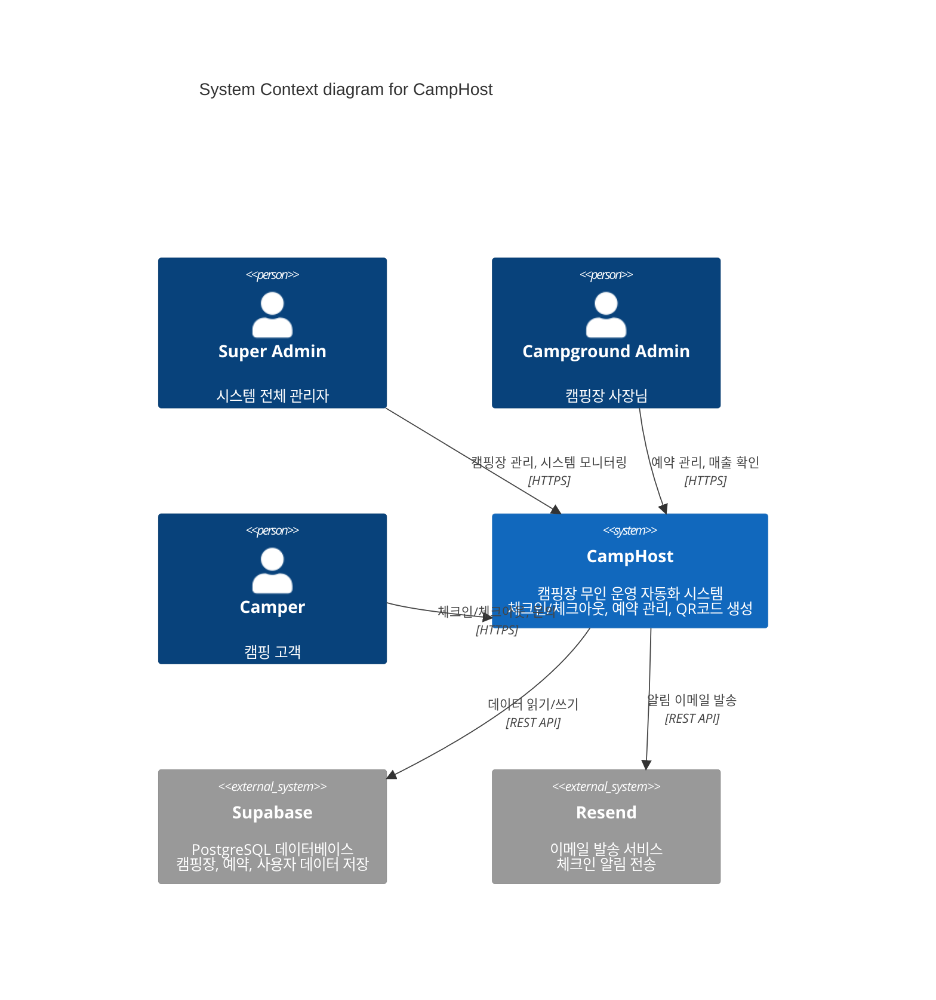
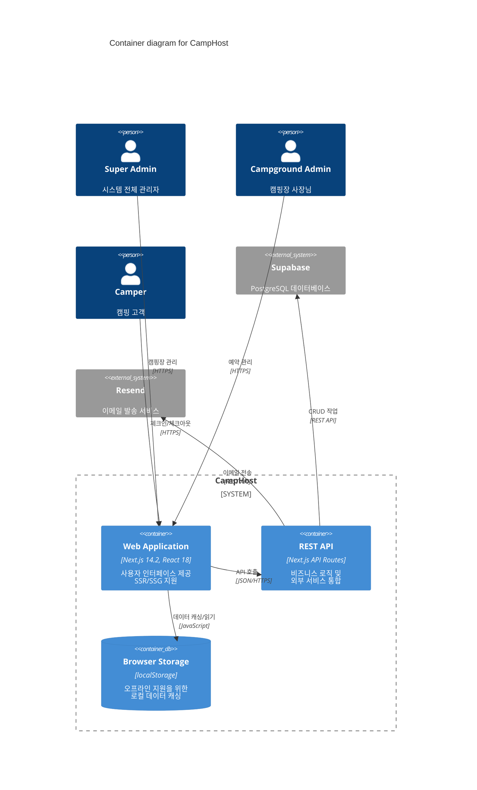
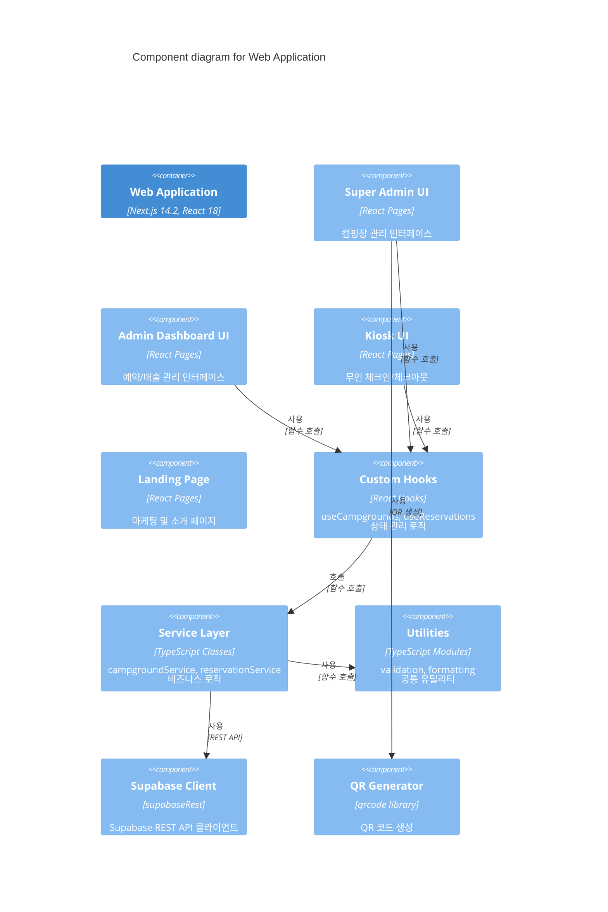

# CampHost System Architecture - C4 Model

이 문서는 CampHost (오도이촌 캠핑장 무인 운영 시스템)의 아키텍처를 C4 모델로 표현합니다.

## 목차
- [Level 1: System Context](#level-1-system-context)
- [Level 2: Container Diagram](#level-2-container-diagram)
- [Level 3: Component Diagram](#level-3-component-diagram)
- [Technology Stack](#technology-stack)

---

## Level 1: System Context

시스템의 전체적인 컨텍스트와 사용자, 외부 시스템과의 관계를 보여줍니다.



### 주요 사용자 (Actors)

1. **Super Admin (슈퍼 관리자)**
   - 전체 캠핑장 관리 및 추가
   - 시스템 메트릭 모니터링
   - 캠핑장 상태 변경 (활성화/비활성화/삭제)
   - QR 코드 생성 및 관리

2. **Campground Admin (캠핑장 사장님)**
   - 자신의 캠핑장 예약 관리
   - 매출 통계 확인
   - 객실 및 설정 관리
   - 문의 응답

3. **Camper (캠핑 고객)**
   - QR 코드를 통한 키오스크 접근
   - 무인 체크인/체크아웃
   - 문의 작성

### 외부 시스템

1. **Supabase (PostgreSQL)**
   - 캠핑장 정보 (campgrounds)
   - 예약 정보 (reservations)
   - 문의 정보 (inquiries)
   - 대시보드 메트릭 뷰

2. **Resend (Email Service)**
   - 체크인 알림 이메일
   - 관리자 알림

---

## Level 2: Container Diagram

CampHost 시스템 내부의 주요 컨테이너들과 그 관계를 보여줍니다.



### 컨테이너 설명

1. **Web Application (Next.js 14.2)**
   - **기술**: Next.js (App Router), React 18, TypeScript
   - **역할**:
     - 사용자 인터페이스 렌더링
     - 클라이언트 사이드 상태 관리
     - 라우팅 및 네비게이션
   - **주요 페이지**:
     - `/` - 랜딩 페이지
     - `/super-admin/dashboard` - 슈퍼 관리자 대시보드
     - `/admin/*` - 캠핑장 관리자 페이지
     - `/kiosk` - 무인 키오스크 인터페이스

2. **REST API (Next.js API Routes)**
   - **기술**: Next.js API Routes, Node.js
   - **역할**:
     - 비즈니스 로직 처리
     - 외부 서비스 통합
     - 인증 및 권한 검증
   - **주요 엔드포인트**:
     - `/api/admin/login` - 관리자 로그인
     - `/api/notify/checkin` - 체크인 알림
     - `/api/dev/*` - 개발/테스트 도구

3. **Browser Storage (localStorage)**
   - **기술**: Web Storage API
   - **역할**:
     - 오프라인 지원
     - 데이터 캐싱
     - 세션 관리
   - **저장 데이터**:
     - 캠핑장 목록
     - 예약 정보 (폴백)
     - 사용자 세션

---

## Level 3: Component Diagram

Web Application 컨테이너 내부의 주요 컴포넌트들을 보여줍니다.



### 주요 컴포넌트 설명

#### UI Components

1. **Super Admin UI** (`app/super-admin/dashboard/`)
   - 캠핑장 CRUD 작업
   - 시스템 메트릭 대시보드
   - QR 코드 생성 및 관리
   - 캠핑장 상태 관리

2. **Admin Dashboard UI** (`app/admin/`)
   - `/dashboard` - 메인 대시보드
   - `/reservations` - 예약 관리
   - `/revenue` - 매출 통계
   - `/rooms` - 객실 관리
   - `/settings` - 설정

3. **Kiosk UI** (`app/kiosk/`)
   - 예약 검색 (이름 + 전화번호)
   - 체크인/체크아웃 처리
   - 실제 체크인/체크아웃 시간 기록
   - 문의 작성

4. **Landing Page** (`app/page.tsx`, `components/`)
   - Hero 섹션
   - 솔루션 소개
   - FAQ
   - CTA (Call to Action)

#### Service Layer

1. **Custom Hooks** (`src/hooks/index.ts`)
   - `useCampgrounds()` - 캠핑장 데이터 관리
   - `useReservations()` - 예약 데이터 관리
   - `useAuth()` - 인증 관리
   - `useForm()` - 폼 상태 관리
   - `useLocalStorage()` - localStorage 관리

2. **Service Layer** (`lib/`, `src/services/`)
   - `campgroundService` - 캠핑장 CRUD
   - `reservationService` - 예약 CRUD
   - `userService` - 사용자 인증/관리

3. **Supabase Client** (`src/services/supabaseRest.ts`)
   - REST API 클라이언트
   - CRUD 헬퍼 함수
   - 에러 처리

#### Utilities

1. **Validation Utils** (`src/utils/`)
   - 폼 유효성 검사
   - 데이터 검증

2. **QR Generator**
   - QR 코드 생성 (`qrcode` 라이브러리 사용)
   - 캠핑장별 고유 URL 생성

---

## Technology Stack

### Frontend
- **Framework**: Next.js 14.2 (App Router)
- **UI Library**: React 18.3
- **Language**: TypeScript 5.4
- **Styling**: CSS Modules, Global CSS
- **State Management**: React Hooks, Context API (선택적)

### Backend
- **Runtime**: Node.js
- **API**: Next.js API Routes
- **Database**: Supabase (PostgreSQL)
- **Email**: Resend API

### Testing
- **Test Framework**: Jest 30.2
- **Testing Library**: @testing-library/react 16.3
- **Environment**: jsdom (browser), node (API)

### DevOps & Tools
- **Version Control**: Git
- **Package Manager**: npm
- **Build Tool**: Next.js built-in
- **Linting**: ESLint (Next.js config)

### External Services
- **Supabase**
  - PostgreSQL Database
  - REST API
  - Row Level Security (RLS)

- **Resend**
  - Transactional Email
  - Email Templates

### Libraries & Dependencies
- `qrcode` - QR 코드 생성
- `@types/*` - TypeScript 타입 정의

---

## Data Flow

### 1. 캠핑장 생성 플로우 (Super Admin)
```
Super Admin → Web UI → addCampground()
                ↓
          Supabase Insert (UUID 생성)
                ↓
          localStorage 동기화 (UUID 사용)
                ↓
          QR 코드 생성
```

### 2. 체크인 플로우 (Kiosk)
```
Camper → Kiosk UI → 예약 검색 (이름 + 전화번호)
              ↓
        Supabase 조회
              ↓
        예약 확인 → 체크인 버튼 클릭
              ↓
        actual_checkin_time 기록
              ↓
        이메일 알림 (Resend API)
```

### 3. 예약 관리 플로우 (Admin)
```
Admin → Dashboard UI → useReservations Hook
                ↓
          Service Layer
                ↓
    ┌─────────┴──────────┐
    ↓                    ↓
Supabase          localStorage
(Primary)         (Fallback)
```

---

## Security Considerations

### Authentication
- Super Admin: 하드코딩된 크레덴셜 (개선 필요)
- Campground Admin: 캠핑장별 비밀번호
- Session: localStorage 기반 (Token 방식 개선 필요)

### Authorization
- Super Admin: 전체 시스템 접근
- Campground Admin: 자신의 캠핑장 데이터만 접근
- Kiosk: 읽기 전용 + 체크인/체크아웃 쓰기

### Data Protection
- Supabase RLS (Row Level Security) 사용
- API 라우트에서 권한 검증
- 민감 정보 환경 변수 저장

---

## Performance Optimizations

### Client-Side
- localStorage 캐싱으로 오프라인 지원
- Next.js SSR/SSG로 초기 로딩 속도 향상
- React 컴포넌트 메모이제이션

### Server-Side
- Supabase 인덱싱
- API 응답 캐싱 (필요시)
- 페이지네이션 (대량 데이터)

---

## Future Improvements

### Architecture
1. **인증 개선**
   - JWT 기반 인증
   - Refresh Token 구현
   - OAuth 통합

2. **상태 관리**
   - Zustand 또는 Redux 도입
   - 중앙화된 상태 관리

3. **API Layer**
   - GraphQL 고려
   - API 버저닝
   - Rate Limiting

4. **실시간 기능**
   - Supabase Realtime 활용
   - WebSocket 연결
   - 실시간 알림

### Infrastructure
1. **CI/CD 파이프라인 구축**
2. **모니터링 및 로깅**
3. **에러 추적 (Sentry 등)**
4. **성능 모니터링 (Vercel Analytics)**

---

## Conclusion

CampHost는 Next.js와 Supabase를 기반으로 한 모던 웹 애플리케이션으로, 캠핑장 무인 운영을 효율적으로 지원합니다.

현재 아키텍처는 MVP 단계로 잘 작동하고 있으며, 향후 확장성을 고려한 개선이 지속적으로 진행될 예정입니다.
